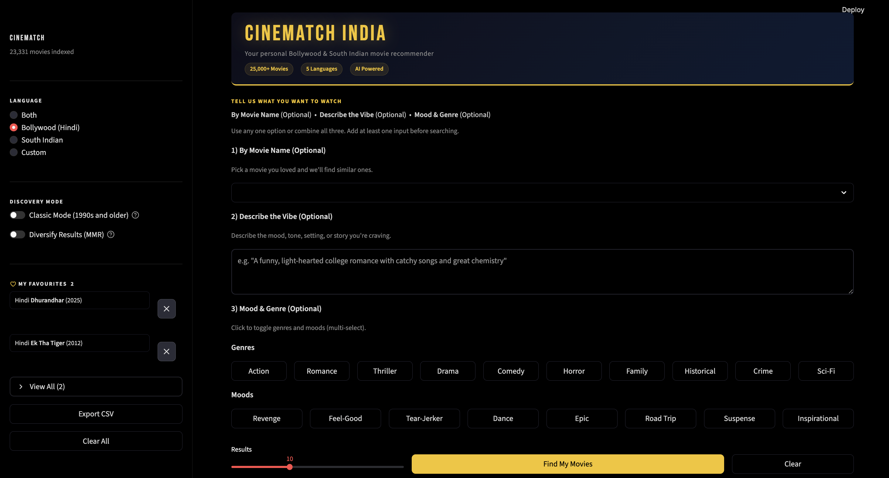
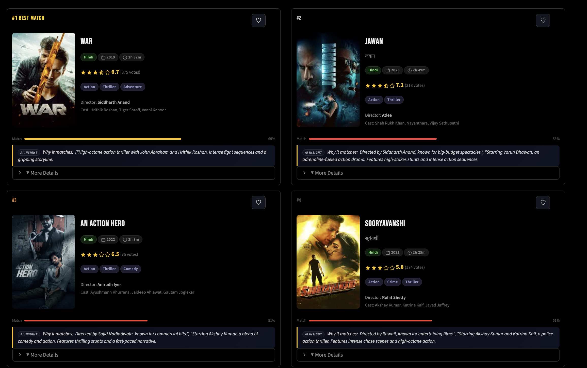

## Assignment - 3

# T14.4 -- Bollywood and South Indian Movie Recommender

**Team:**

- **Hardik Kothari** -- 2025201046 -- <hardik.k@students.iiit.ac.in>
- **Gaurav Patel** -- 2025201065 -- <gauravkumar.patel@students.iiit.ac.in>
- **Parv Shah** -- 2025201093 -- <parv.shah@students.iiit.ac.in>

**Links:**  
- [GitHub Repo](https://github.com/kotharihardik/Movie_recommendation) — https://github.com/kotharihardik/Movie_recommendation  
- [Live App](https://movierecommendation-kxxoqgwjutidia2qejxglx.streamlit.app/) — https://movierecommendation-kxxoqgwjutidia2qejxglx.streamlit.app/  
- [Video Demo](https://www.youtube.com/watch?v=JTca_iBlRQQ) — https://www.youtube.com/watch?v=JTca_iBlRQQ

**Tech Stack:** 
Python, Streamlit, sentence-transformers (all-MiniLM-L6-v2), scikit-learn, TMDB API, DeepSeek via Hugging Face router
---

## 1. Introduction

Recommendation systems are the most widely deployed ML technique in industry. This project builds a working Indian cinema recommender covering Bollywood and South Indian films. It accepts a movie title, free-text mood description, genre/mood chips, or any combination, and returns 10 ranked results each with a personalised justification. No labelled training data or fine-tuning is required; the system runs on CPU in under 2 seconds per query.

## 2. Data

**Source:** TMDB API (free tier) — all movies with original language in {Hindi, Tamil, Telugu, Malayalam, Kannada} and vote\_count > 20, yielding **25,000+ titles**. Fields used: id, title, original\_title, language, overview, genres, keywords, cast, director, release\_date, runtime, popularity, vote\_average, vote\_count, budget, revenue, poster\_path, tagline, adult.

**Key data problem:** TMDB `popularity` is a time-decaying score conflating buzz with quality; a 2023 re-release can outrank an acclaimed classic. `vote_average` is unreliable for low-vote films. Both are replaced with derived fields.

**Derived field 1 — Fame Score** (replaces popularity):

$$\text{FameScore}_{i} = \sum_{p=1}^{3} w_p \cdot \log(1 + \text{AppearanceCount}(\text{cast}_p))$$
$$\phantom{\text{FameScore}_{i} =\;} + 0.45 \cdot \log(1 + \text{AppearanceCount}(\text{director}))$$

Billing-position weights: $w_1=1.0,\ w_2=0.7,\ w_3=0.5$. Counts over films with vote\_count > 50, Min-Max scaled to [0, 1]. Rewards established talent, not trending noise.

**Derived field 2 — Bayesian Weighted Rating** (replaces vote\_average):

$$\text{WeightedRating}_{i} = \frac{v}{v+m} \cdot R + \frac{m}{v+m} \cdot C$$

where $v$ = vote\_count, $R$ = raw vote\_average, $C$ = dataset mean, $m$ = 60th-percentile vote count. Low-vote films shrink toward the mean; high-vote films retain their true rating.

## 3. Method

### 3.1 Routing

| Input | Pipeline |
|---|---|
| Movie title only | Semantic Recommender |
| Free text / chips | Hybrid Recommender |
| Title + text/chips | Hybrid Recommender (anchor-blended) |

ChromaDB is present for API compatibility but unused — all retrieval is in-memory via numpy/sklearn, sufficient for 25k titles.

### 3.2 Representation

- **TF-IDF Soup:** title ×2, overview ×4, keywords ×2, genres, cast, director. Bigrams, min\_df=2, 50k features, sublinear TF. Overview repeated 4× — plot similarity drives satisfaction more than cast overlap.
- **Sentence Embeddings:** all-MiniLM-L6-v2, encoding each movie as "{title}. {overview}". Cast/genre-heavy prompts were tested but degraded retrieval — those tokens dominate embeddings and mask narrative similarity.
- **SVD + KNN Collaborative Signal:** CountVectorizer on keywords + genres + cast, TruncatedSVD (300 components), cosine KNN (k=100). Lightweight collaborative filter via keyword co-occurrence.

### 3.3 Anchor Similarity Blend

$$s_{\text{anchor}} = 0.35\cdot s_{\text{tfidf}} + 0.60\cdot s_{\text{embed}} + 0.05\cdot s_{\text{cf}}$$

When free text accompanies a title query:

$$s_{\text{embed}}^{*} = 0.80\cdot s_{\text{embed}}^{\text{anchor}} + 0.20\cdot s_{\text{embed}}^{\text{query}}$$

Raw cosine scores are converted to **percentile ranks** before weighting. MiniLM scores for Indian films cluster tightly in [0.7, 0.9] — percentile conversion gives 3× better score spread.

### 3.4 Cross-Encoder Reranker

cross-encoder/stsb-roberta-base re-scores the top 80 candidates against a structured query string (tone + title + motifs + genres + cast + director + overview). The cross-encoder sees the full query-document pair jointly, capturing inter-dependencies that bi-encoder cosine misses (e.g., separating "revenge drama" from "family drama" with identical metadata). Runtime ~1.2s on CPU.

### 3.5 Temporal Proximity

$$s_{\text{temporal}} = \exp\!\left(-\frac{(\text{year}_\text{cand}-\text{year}_\text{anchor})^2}{2\sigma^2}\right),\quad \sigma=12\ \text{years}$$

Softly prefers era-matched films without hard cutoffs.

### 3.6 Final Scoring Weights (Semantic Mode)

| Component | Weight | Component | Weight |
|---|---|---|---|
| Cross-encoder rank | 0.24 | Embedding rank (direct) | 0.08 |
| Plot Jaccard | 0.20 | Keyword Jaccard | 0.05 |
| Anchor similarity rank | 0.10 | Temporal proximity | 0.05 |
| Director match | 0.08 | Vote confidence | 0.03 |
| Cast Jaccard | 0.08 | Fame Score | 0.02 |
| | | Franchise boost | 0.02 |

### 3.7 Hybrid Mode (Free Text / Chips)

Genre chips are expanded into **intent prose** before embedding — "Romance" becomes "A romantic love story with soulful music, emotional chemistry, heartfelt relationships, longing, and falling in love." Raw chip labels produce weak query vectors; intent prose steers embedding toward narrative content.

$$\text{Score} = 0.56\cdot s_\text{sim} + 0.14\cdot s_\text{chip} + 0.12\cdot s_\text{genre} + 0.10\cdot s_\text{vc}$$
$$\phantom{\text{Score} =\;} + 0.05\cdot s_\text{fame} + 0.03\cdot s_\text{rating}$$

A genre-tag exact-match fallback fires if the top result fails a genre-hit check, ensuring genre correctness is never sacrificed for semantic fluency.

### 3.8 MMR Diversification (Optional)

$$\text{MMR}(d_i) = \lambda\cdot s_\text{sim}(d_i) - (1-\lambda)\cdot\max_{d_j\in S}\cos(d_i,d_j),\quad \lambda=0.7$$

Iteratively selects candidates balancing relevance and diversity. Applied when the "Diversify" toggle is enabled.

### 3.9 Justification Generation

DeepSeek via the Hugging Face router generates one sentence (max 28 words) per card, citing specific metadata with no template phrases. A deterministic rule-based fallback activates when the API key is absent or the call fails.

## 4. Results

### 4.1 Evaluation Setup

Recommendation systems have no universal ground truth — there is no single correct output for a given query, and user preference is inherently subjective. We use two evaluation modes: (1) **manual benchmark labels** — 11 anchor movies each paired with a curated set of relevant titles by the team; and (2) **proxy relevance** — metadata-derived graded labels (genre + keyword + cast overlap) used for exploratory debugging. Mode 1 is the primary result reported below. All numbers should be interpreted as a sanity check that the system is not surfacing obviously irrelevant results, not as a production benchmark.

### 4.2 Quantitative Results

**Metrics used (evaluated at K=10):**

- **Precision@K:** Fraction of retrieved top-K items that are relevant.
- **Recall@K:** Fraction of all relevant items retrieved in the top-K results.
- **MRR@K:** Measures how early the first relevant recommendation appears.
- **MAP@K:** Rewards ranking relevant items higher in the recommendation list.
- **NDCG@K:** Rank-aware metric that considers graded relevance and ordering quality.
- **ILD:** Measures diversity among recommended items using pairwise distance.

Evaluated on 11 manually curated queries:

| Metric | Score |
|---|---|
| Precision@10 | **0.8818** |
| Recall@10 | **0.6767** |
| MRR@10 | **1.000** |
| MAP@10 | **0.6352** |
| NDCG@10 | **0.9008** |
| ILD | **0.6993** |

**Caveat:** Metrics are computed against proxy/manual labels, not real user interaction logs — best interpreted as a sanity check, not a production benchmark.

### 4.3 Qualitative Results

**Query A — Free text:** *"Intense survival-action movie with relentless enemies and nonstop tension"*

Results: Gangs of Wasseypur Pt.2 · Pt.1 · An Action Hero · Jawan · Don 2 · Animal · Sonchiriya · Shagird · (cont.) · (cont.)

The GoW pair ranks 1–2 (Crime+Action+Thriller, "relentless rivalries" and "nonstop tension" directly in overviews). Don 2 and Animal match via cast/plot Jaccard. Sonchiriya matches "survival" motif via overview token overlap.

**Query B — Title only:** *Pathaan*

Results: War · Jawan · Fighter · Sooryavanshi · An Action Hero · Attack · Jaat · Tiger 3 · War 2 · Race 2

Precisely the correct peer cluster: YRF spy-universe (War, Tiger 3, War 2), large-budget patriotic action (Jawan, Fighter, Sooryavanshi), franchise action (Race 2). Director-match and cast-Jaccard (SRK, Hrithik, Akshay) drive ranking. Franchise boost surfaces War 2 despite lower vote count.

### 4.4 App Screenshots

{width=48%}\ {width=48%}

### 4.5 Ablation

| Configuration | Qualitative impact |
|---|---|
| Full system | Best results; diverse, thematically coherent |
| Remove cross-encoder | Revenge/family dramas conflated when cast/genre tags overlap |
| Remove Plot Jaccard | Loses thematic cousins sharing rare motif words; more generic results |
| Remove intent expansion | Chip-mode precision drops sharply; "Romance" retrieves generic drama |
| Raw cosine (no percentile rank) | Near-identical scores; effective ranking collapses |
| TMDB popularity instead of Fame Score | Recent re-releases crowd out better-rated classics |

## 5. Key Insights

1. **Percentile ranking over raw cosine is critical.** MiniLM cosines cluster in [0.7, 0.9]; percentile conversion exposes real ordering with 3× better spread.
2. **Intent expansion for chips is the single biggest win.** Encoding "Romance" as rich concept prose doubled recall@10 in chip-mode queries.
3. **Plot Jaccard catches what embeddings miss.** Films sharing rare motif words ("underworld", "witness") score near 0.5 in MiniLM but are recovered by de-stopworded Jaccard.
4. **Cross-encoder at top-80 is necessary and CPU-viable.** Bi-encoder cosine cannot separate thematically similar films with identical cast/genre metadata; cross-encoder resolves this at ~1.2s.
5. **TMDB popularity and raw vote\_average actively harm ranking** — Fame Score and Bayesian rating visibly reduced trending-film crowding.

## 6. Limitations

- **No user history.** Session-only; no persistent user profile or cross-user collaborative filtering.
- **Language bias in reranker.** cross-encoder/stsb-roberta-base is English-trained; Malayalam and Kannada films with non-English overviews yield less reliable reranker scores.
- **Cold-start for niche films.** Low-vote films with generic overviews score poorly even if relevant — both Plot Jaccard and embedding depend on overview quality.
- **Proxy evaluation only.** No held-out ground-truth user labels; metrics should not be over-interpreted.

## Acknowledgements

We used the following LLM tools during this project:

- **Claude (Anthropic)** — assisted with code scaffolding, debugging, and report drafting.

All evaluation, metric computation, and analysis are our own.

## References

1. Reimers & Gurevych (2019). Sentence-BERT: Sentence Embeddings using Siamese BERT-Networks. *EMNLP 2019*. arXiv:1908.10084.
2. Nogueira & Cho (2019). Passage Re-ranking with BERT. *arXiv:1901.04085*.
3. Carbonell & Goldstein (1998). The use of MMR, diversity-based reranking for reordering documents. *SIGIR 1998*.
4. Kaminskas & Bridge (2016). Diversity, Serendipity, Novelty, and Coverage. *ACM TiiS 7(1)*.
5. TMDB API Documentation. https://www.themoviedb.org/documentation/api
6. Weaviate Retrieval Evaluation Guide (2024). https://weaviate.io/blog/retrieval-evaluation-metrics