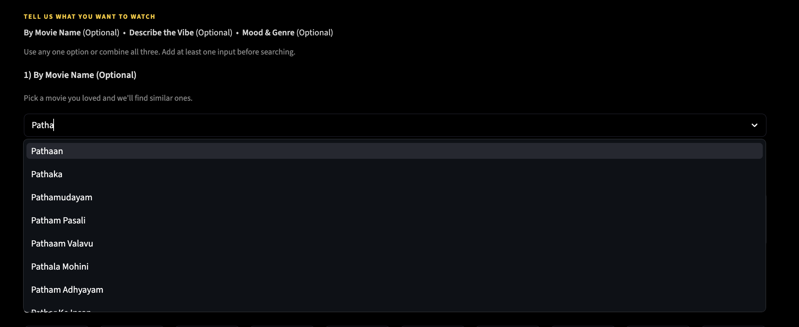
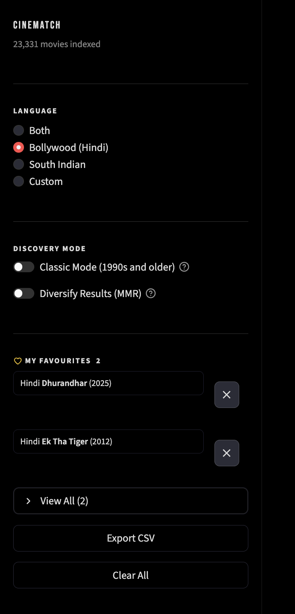
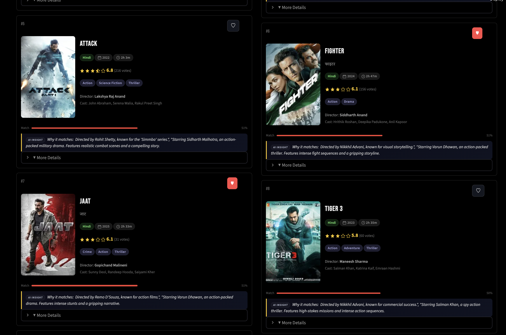
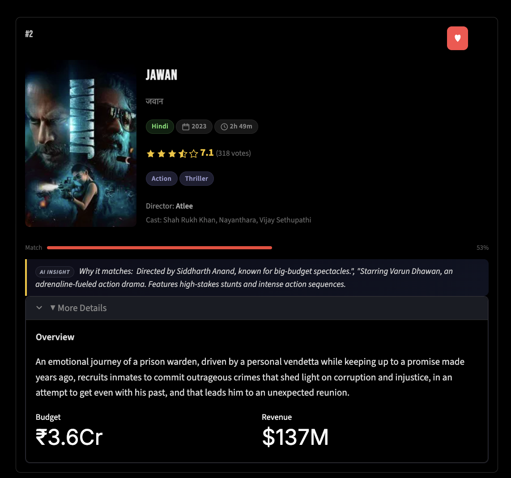
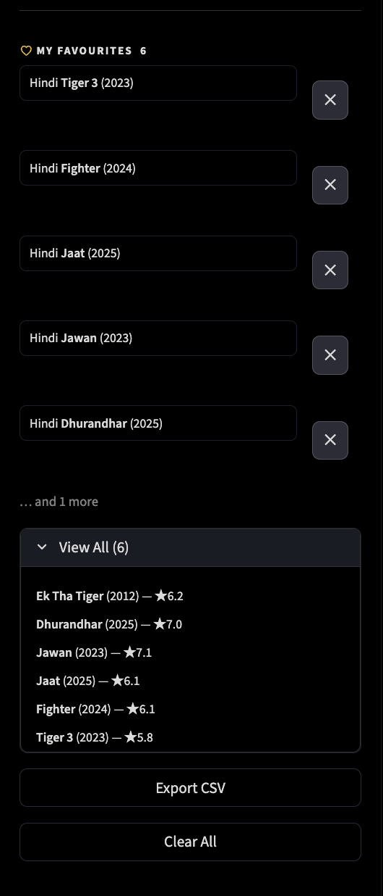
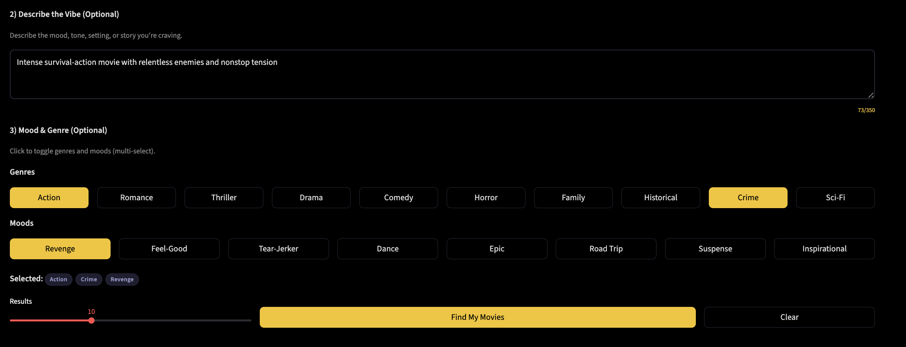
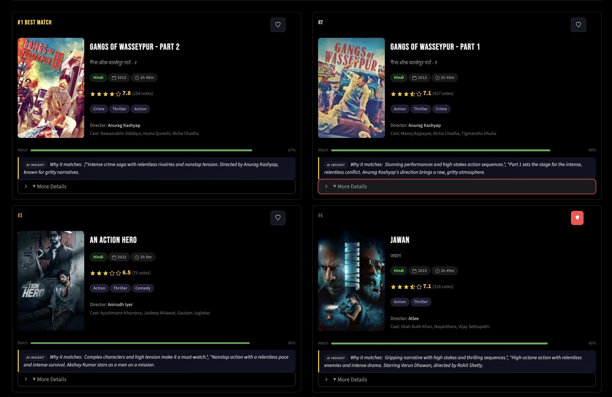
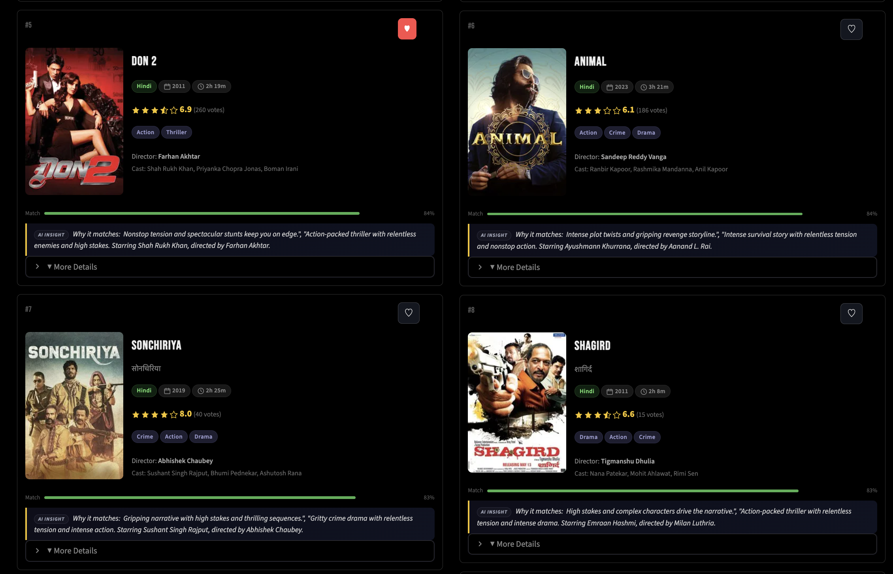

# Screenshot

Project visual report covering key screens and user flows.

## 1. Main Dashboard Overview
Main landing view with header, sidebar filters, favourites, and search controls.
Path: `Image/1.png`

## 2. Movie Search Autocomplete
Typeahead suggestions in the movie-name search field.
Path: `Image/2.png`

## 3. Sidebar Controls
Language filter, discovery toggles, and favourites tools in compact layout.
Path: `Image/3.png`

## 4. Results Grid - Top Matches
Top recommendation cards with metadata, match score, and AI insight.
Path: `Image/4.png`

## 5. Results Grid - Additional Matches
Continuation of recommendation cards with saved/favourited indicators.
Path: `Image/5.png`

## 6. Expanded Movie Details
Expanded card view showing overview and detailed movie metadata.
Path: `Image/6.png`

## 7. Favourites Panel (Expanded)
Full favourites list with rating summary and export/clear actions.
Path: `Image/7.png`

## 8. Vibe + Mood/Genre Input
Free-text vibe input with multi-select genre and mood chips.
Path: `Image/8.png`

## 9. Vibe-Based Results - Top Matches
Top results for vibe-driven search query and selected filters.
Path: `Image/9.png`

## 10. Vibe-Based Results - Additional Matches
Continuation of vibe-query results with card-level details.
Path: `Image/10.png`

